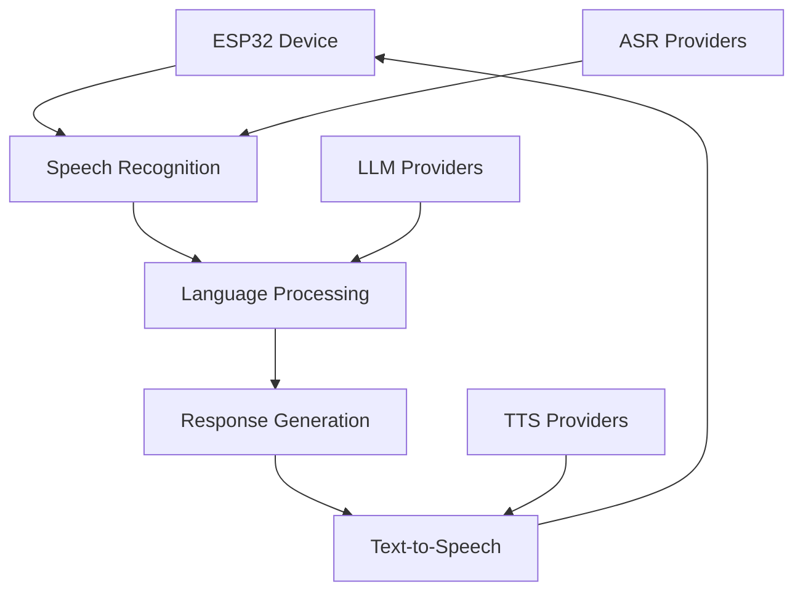

# 🤖 AI Providers Configuration

Configure your AI providers to enable speech recognition, language processing, and text-to-speech capabilities. Xiaozhi supports multiple providers for flexibility and cost optimization.

## 🎯 Provider Overview

### **AI Stack Components**



### **Provider Categories**

| Category | Purpose | Examples |
|----------|---------|---------|
| **ASR** | Speech-to-Text | Whisper, OpenAI, Groq |
| **LLM** | Language Processing | OpenAI, LMStudio, Ollama |
| **TTS** | Text-to-Speech | EdgeTTS, OpenAI, Azure |
| **VLLM** | Vision Processing | OpenAI, Local Models |

## 🆓 Free Tier Setup

### **Recommended Free Configuration**

```yaml
# Free AI Stack
selected_module:
  ASR: WhisperASR          # Local speech recognition
  LLM: LMStudioLLM         # Local language model
  TTS: EdgeTTS             # Free text-to-speech
  VLLM: OpenAILLMVLLM      # OpenAI vision (optional)
```

### **WhisperASR (Speech Recognition)**

```yaml
ASR:
  WhisperASR:
    type: whisper
    model_name: base        # Options: tiny, base, small, medium, large
    device: auto           # auto, cpu, cuda
    language: null         # null for auto-detect, or "en", "es", etc.
    output_dir: tmp/
```

**Model Sizes:**
- **tiny**: ~39MB - Fastest, lowest accuracy
- **base**: ~74MB - Good balance
- **small**: ~244MB - Better accuracy
- **medium**: ~769MB - High accuracy
- **large**: ~1550MB - Best accuracy

### **LMStudioLLM (Language Model)**

```yaml
LLM:
  LMStudioLLM:
    type: openai
    base_url: http://localhost:1234/v1
    api_key: lm-studio
    model_name: llama3.1:8b
```

**Setup Steps:**
1. **Download LMStudio**: [lmstudio.ai](https://lmstudio.ai)
2. **Load a model**: Download llama3.1:8b or similar
3. **Start local server**: Enable local API
4. **Configure Xiaozhi**: Use local API endpoint

### **EdgeTTS (Text-to-Speech)**

```yaml
TTS:
  EdgeTTS:
    type: edge_tts
    voice: en-US-AriaNeural    # Voice options
    rate: +0%                  # Speech rate
    pitch: +0Hz                # Voice pitch
    volume: +0%                # Volume level
```

**Voice Options:**
- **en-US-AriaNeural**: Female, natural
- **en-US-GuyNeural**: Male, natural
- **en-US-JennyNeural**: Female, friendly
- **en-US-RyanNeural**: Male, professional

## 💎 Premium Setup

### **OpenAI Configuration**

```yaml
# Premium AI Stack
selected_module:
  ASR: OpenAIASR
  LLM: OpenAILLM
  TTS: OpenAITTS
  VLLM: OpenAILLMVLLM
```

### **OpenAI ASR**

```yaml
ASR:
  OpenAIASR:
    type: openai
    api_key: your_openai_api_key
    model_name: whisper-1
    language: en
    response_format: json
```

### **OpenAI LLM**

```yaml
LLM:
  OpenAILLM:
    type: openai
    api_key: your_openai_api_key
    model_name: gpt-4o-mini        # Options: gpt-4o, gpt-4o-mini, gpt-3.5-turbo
    temperature: 0.7
    max_tokens: 1000
    top_p: 1.0
```

**Model Options:**
- **gpt-4o**: Latest, most capable
- **gpt-4o-mini**: Faster, cost-effective
- **gpt-3.5-turbo**: Budget option

### **OpenAI TTS**

```yaml
TTS:
  OpenAITTS:
    type: openai
    api_key: your_openai_api_key
    model_name: tts-1              # Options: tts-1, tts-1-hd
    voice: alloy                   # Options: alloy, echo, fable, onyx, nova, shimmer
    response_format: mp3
    speed: 1.0
```

## 🔧 Advanced Configurations

### **Hybrid Setup (Best of Both Worlds)**

```yaml
# Hybrid Configuration
selected_module:
  ASR: WhisperASR          # Local for privacy
  LLM: OpenAILLM           # Cloud for capability
  TTS: EdgeTTS             # Free for cost
```

### **Privacy-Focused Setup**

```yaml
# Complete Local Setup
selected_module:
  ASR: WhisperASR          # Local processing
  LLM: LMStudioLLM         # Local processing
  TTS: EdgeTTS             # Local processing
```

### **Performance-Optimized Setup**

```yaml
# High-Performance Configuration
selected_module:
  ASR: OpenAIASR           # Cloud for speed
  LLM: OpenAILLM          # Cloud for capability
  TTS: OpenAITTS          # Cloud for quality
```

## 🌐 Additional Providers

### **Groq (Fast LLM)**

```yaml
LLM:
  GroqLLM:
    type: openai
    base_url: https://api.groq.com/openai/v1
    api_key: your_groq_api_key
    model_name: llama-3.1-70b-versatile
```

### **Ollama (Local LLM)**

```yaml
LLM:
  OllamaLLM:
    type: openai
    base_url: http://localhost:11434/v1
    api_key: ollama
    model_name: llama3.1:8b
```

### **Azure Cognitive Services**

```yaml
ASR:
  AzureASR:
    type: azure
    subscription_key: your_azure_key
    region: your_azure_region
    language: en-US

TTS:
  AzureTTS:
    type: azure
    subscription_key: your_azure_key
    region: your_azure_region
    voice: en-US-AriaNeural
```

## ⚙️ Configuration Methods

### **Method 1: Web Interface**

1. **Open web interface**: http://localhost:8001
2. **Go to Model Configuration**
3. **Select provider type** (ASR, LLM, TTS)
4. **Configure settings** and API keys
5. **Save configuration**

### **Method 2: Configuration File**

```bash
# Edit configuration file
nano data/.config.yaml

# Add provider configuration
ASR:
  WhisperASR:
    type: whisper
    model_name: base

LLM:
  OpenAILLM:
    type: openai
    api_key: your_api_key
    model_name: gpt-4o-mini

TTS:
  EdgeTTS:
    type: edge_tts
    voice: en-US-AriaNeural
```

### **Method 3: Environment Variables**

```bash
# Set environment variables
export OPENAI_API_KEY=your_api_key
export GROQ_API_KEY=your_groq_key
export AZURE_SUBSCRIPTION_KEY=your_azure_key

# Restart server
docker-compose restart
```

## 🧪 Testing Providers

### **Test Speech Recognition**

```bash
# Test ASR provider
curl -X POST http://localhost:8000/api/test/asr \
  -H "Content-Type: application/json" \
  -d '{"audio_file": "test.wav"}'
```

### **Test Language Model**

```bash
# Test LLM provider
curl -X POST http://localhost:8000/api/test/llm \
  -H "Content-Type: application/json" \
  -d '{"message": "Hello, how are you?"}'
```

### **Test Text-to-Speech**

```bash
# Test TTS provider
curl -X POST http://localhost:8000/api/test/tts \
  -H "Content-Type: application/json" \
  -d '{"text": "Hello, this is a test."}'
```

## 💰 Cost Optimization

### **Free Tier Strategy**

```yaml
# Maximize free usage
selected_module:
  ASR: WhisperASR          # Completely free
  LLM: LMStudioLLM         # Completely free
  TTS: EdgeTTS             # Completely free
```

### **Hybrid Cost Strategy**

```yaml
# Balance cost and quality
selected_module:
  ASR: WhisperASR          # Free for privacy
  LLM: OpenAILLM           # Pay for capability
  TTS: EdgeTTS             # Free for cost
```

### **Usage Monitoring**

```bash
# Monitor API usage
curl -X GET http://localhost:8000/api/usage/stats

# Check provider status
curl -X GET http://localhost:8000/api/providers/status
```

## 🛠️ Troubleshooting

### **Common Issues**

#### **API Key Errors**
```bash
# Check API key format
echo $OPENAI_API_KEY

# Test API key
curl -H "Authorization: Bearer $OPENAI_API_KEY" \
  https://api.openai.com/v1/models
```

#### **Provider Connection Issues**
```bash
# Check provider status
curl -X GET http://localhost:8000/api/providers/health

# View provider logs
docker-compose logs xiaozhi-server | grep -i provider
```

#### **Model Loading Issues**
```bash
# Check model files
ls -la models/whisper/
ls -la models/vosk/

# Verify model integrity
python -c "import whisper; whisper.load_model('base')"
```

### **Performance Optimization**

#### **Local Model Optimization**
```yaml
# Optimize Whisper performance
ASR:
  WhisperASR:
    device: cuda           # Use GPU if available
    model_name: base       # Balance speed/accuracy
    language: en           # Specify language for speed
```

#### **Cloud Provider Optimization**
```yaml
# Optimize OpenAI usage
LLM:
  OpenAILLM:
    model_name: gpt-4o-mini    # Use faster model
    max_tokens: 500            # Limit response length
    temperature: 0.7           # Reduce randomness
```

## 🎯 Best Practices

### **Provider Selection**

1. **Start with free providers** for testing
2. **Use local providers** for privacy-sensitive applications
3. **Use cloud providers** for production and high-volume usage
4. **Mix providers** for optimal cost/performance balance

### **Configuration Management**

1. **Use environment variables** for sensitive data
2. **Version control** configuration files
3. **Test configurations** before deploying
4. **Monitor usage** and costs regularly

### **Security Considerations**

1. **Rotate API keys** regularly
2. **Use least privilege** access
3. **Monitor API usage** for anomalies
4. **Encrypt sensitive data** at rest

## 🎯 Next Steps

### **After Configuration**

1. **[Basic Setup](../configuration/basic-setup.md)** - Configure server settings
2. **[Test Voice Interaction](../features/voice-interaction.md)** - Verify everything works
3. **[Connect ESP32 Device](../getting-started/first-device.md)** - Add your first device
4. **[Advanced Configuration](../configuration/advanced.md)** - Fine-tune your setup

### **Advanced Topics**

- **[Custom Providers](../configuration/advanced.md)** - Create custom AI providers
- **[Performance Tuning](../configuration/advanced.md)** - Optimize for your use case
- **[Monitoring](../configuration/advanced.md)** - Set up monitoring and alerts

## 🆘 Need Help?

- **Configuration Issues?** Check [Troubleshooting](../support/troubleshooting.md)
- **Provider Questions?** Browse [FAQ](../support/faq.md)
- **API Problems?** See [API Documentation](../reference/api.md)

---

## 🎯 Quick Reference

### **Free Providers**
- **ASR**: WhisperASR (local)
- **LLM**: LMStudioLLM (local)
- **TTS**: EdgeTTS (free)

### **Premium Providers**
- **ASR**: OpenAIASR
- **LLM**: OpenAILLM
- **TTS**: OpenAITTS

### **Configuration Files**
- **Web Interface**: http://localhost:8001
- **Config File**: `data/.config.yaml`
- **Environment**: `.env` file

---

**Your AI providers are now configured! 🎉**

👉 **[Next: Basic Setup →](../configuration/basic-setup.md)**
