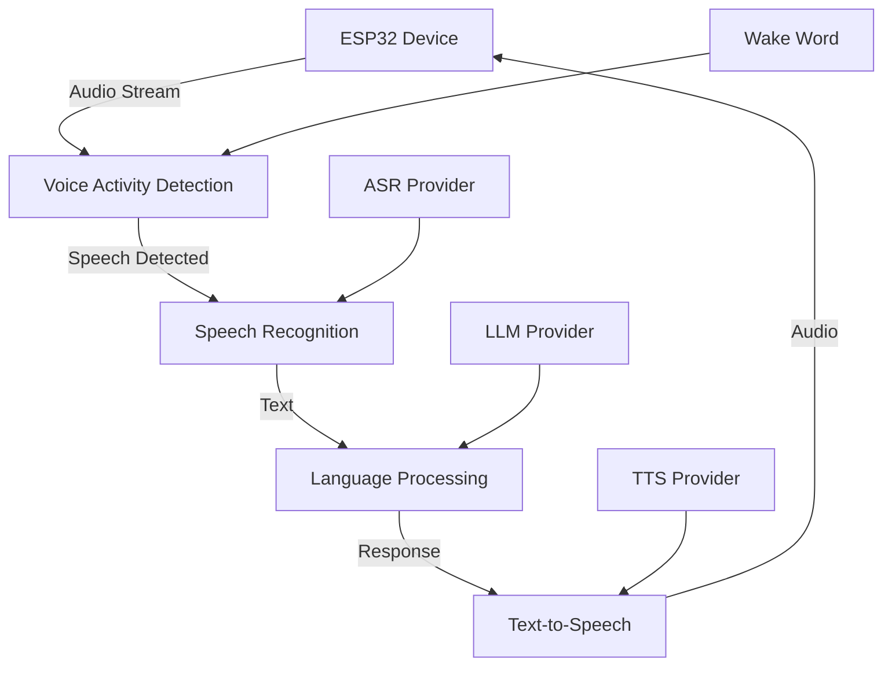
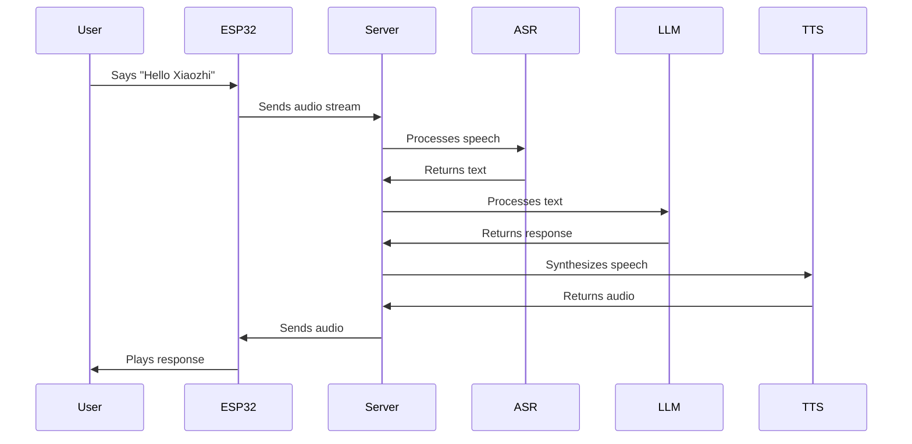

# 🎤 Voice Interaction

Xiaozhi's voice interaction system enables natural conversations with your ESP32 devices. This guide covers how voice recognition, language processing, and speech synthesis work together to create seamless voice experiences.

## 🎯 How Voice Interaction Works

### **Voice Processing Pipeline**



### **Processing Steps**

1. **🎤 Audio Capture**: ESP32 captures audio from microphone
2. **🔍 Voice Activity Detection**: Detects when speech starts/stops
3. **📝 Speech Recognition**: Converts speech to text
4. **🧠 Language Processing**: Understands intent and generates response
5. **🔊 Speech Synthesis**: Converts response to audio
6. **📡 Audio Output**: ESP32 plays synthesized speech

## 🔍 Voice Activity Detection (VAD)

### **What is VAD?**

Voice Activity Detection determines when someone is speaking, filtering out background noise and silence. This improves accuracy and reduces unnecessary processing.

### **VAD Providers**

#### **SileroVAD (Default)**
```yaml
VAD:
  SileroVAD:
    type: silero_vad
    model_path: models/silero_vad.jit
    threshold: 0.5
    min_speech_duration: 0.25
    min_silence_duration: 0.5
```

**Features:**
- **High accuracy** speech detection
- **Low latency** processing
- **Noise robust** performance
- **Free** and open source

#### **WebRTC VAD**
```yaml
VAD:
  WebRTCVAD:
    type: webrtc_vad
    mode: 2
    sample_rate: 16000
    frame_duration: 30
```

**Features:**
- **Lightweight** processing
- **Real-time** performance
- **Configurable** sensitivity
- **Free** implementation

### **VAD Configuration**

```yaml
# VAD settings
vad:
  enabled: true
  provider: SileroVAD
  sensitivity: 0.5        # 0.0 = most sensitive, 1.0 = least sensitive
  min_speech_ms: 250      # Minimum speech duration
  min_silence_ms: 500     # Minimum silence duration
  pre_padding_ms: 100     # Audio before speech
  post_padding_ms: 100    # Audio after speech
```

## 📝 Speech Recognition (ASR)

### **ASR Providers**

#### **WhisperASR (Recommended)**
```yaml
ASR:
  WhisperASR:
    type: whisper
    model_name: base        # tiny, base, small, medium, large
    device: auto           # auto, cpu, cuda
    language: null         # null for auto-detect
    temperature: 0.0
    compression_ratio_threshold: 2.4
    logprob_threshold: -1.0
    no_speech_threshold: 0.6
```

**Model Comparison:**
| Model | Size | Speed | Accuracy | Use Case |
|-------|------|-------|----------|----------|
| **tiny** | 39MB | Fastest | Basic | Quick testing |
| **base** | 74MB | Fast | Good | General use |
| **small** | 244MB | Medium | Better | Production |
| **medium** | 769MB | Slow | High | High accuracy |
| **large** | 1550MB | Slowest | Best | Maximum quality |

#### **OpenAI ASR**
```yaml
ASR:
  OpenAIASR:
    type: openai
    api_key: your_openai_api_key
    model_name: whisper-1
    language: en
    response_format: json
    temperature: 0.0
```

#### **Groq ASR**
```yaml
ASR:
  GroqASR:
    type: openai
    base_url: https://api.groq.com/openai/v1
    api_key: your_groq_api_key
    model_name: whisper-large-v3
    language: en
```

### **ASR Configuration**

```yaml
# ASR settings
asr:
  provider: WhisperASR
  language: null           # null for auto-detect
  sample_rate: 16000      # Audio sample rate
  channels: 1             # Mono audio
  chunk_size: 1024        # Audio chunk size
  timeout: 30             # Processing timeout
  retry_count: 3          # Retry attempts
```

## 🧠 Language Processing (LLM)

### **LLM Providers**

#### **OpenAI LLM**
```yaml
LLM:
  OpenAILLM:
    type: openai
    api_key: your_openai_api_key
    model_name: gpt-4o-mini
    temperature: 0.7
    max_tokens: 1000
    top_p: 1.0
    frequency_penalty: 0.0
    presence_penalty: 0.0
```

**Model Options:**
- **gpt-4o**: Latest, most capable
- **gpt-4o-mini**: Faster, cost-effective
- **gpt-3.5-turbo**: Budget option

#### **LMStudio LLM**
```yaml
LLM:
  LMStudioLLM:
    type: openai
    base_url: http://localhost:1234/v1
    api_key: lm-studio
    model_name: llama3.1:8b
    temperature: 0.7
    max_tokens: 1000
```

#### **Ollama LLM**
```yaml
LLM:
  OllamaLLM:
    type: openai
    base_url: http://localhost:11434/v1
    api_key: ollama
    model_name: llama3.1:8b
    temperature: 0.7
```

### **LLM Configuration**

```yaml
# LLM settings
llm:
  provider: OpenAILLM
  system_prompt: |
    You are Xiaozhi, a helpful AI assistant. 
    Respond naturally and conversationally.
  max_tokens: 1000
  temperature: 0.7
  top_p: 1.0
  timeout: 30
  retry_count: 3
```

## 🔊 Text-to-Speech (TTS)

### **TTS Providers**

#### **EdgeTTS (Free)**
```yaml
TTS:
  EdgeTTS:
    type: edge_tts
    voice: en-US-AriaNeural
    rate: +0%
    pitch: +0Hz
    volume: +0%
    output_format: mp3
```

**Voice Options:**
- **en-US-AriaNeural**: Female, natural
- **en-US-GuyNeural**: Male, natural
- **en-US-JennyNeural**: Female, friendly
- **en-US-RyanNeural**: Male, professional

#### **OpenAI TTS**
```yaml
TTS:
  OpenAITTS:
    type: openai
    api_key: your_openai_api_key
    model_name: tts-1
    voice: alloy
    response_format: mp3
    speed: 1.0
```

**Voice Options:**
- **alloy**: Neutral, balanced
- **echo**: Male, clear
- **fable**: British accent
- **onyx**: Deep, authoritative
- **nova**: Young, energetic
- **shimmer**: Soft, gentle

#### **Azure TTS**
```yaml
TTS:
  AzureTTS:
    type: azure
    subscription_key: your_azure_key
    region: your_azure_region
    voice: en-US-AriaNeural
    rate: +0%
    pitch: +0Hz
```

### **TTS Configuration**

```yaml
# TTS settings
tts:
  provider: EdgeTTS
  voice: en-US-AriaNeural
  rate: +0%               # Speech rate
  pitch: +0Hz            # Voice pitch
  volume: +0%            # Volume level
  output_format: mp3     # Audio format
  sample_rate: 22050     # Output sample rate
  timeout: 30            # Processing timeout
```

## 🎯 Wake Word Detection

### **What is Wake Word Detection?**

Wake word detection allows the device to respond only when a specific phrase is spoken, preventing accidental activations and saving power.

### **Wake Word Configuration**

```yaml
# Wake word settings
wake_word:
  enabled: true
  phrase: "Hello Xiaozhi"
  sensitivity: 0.5        # 0.0 = most sensitive, 1.0 = least sensitive
  timeout: 5              # Seconds to listen after wake word
  cooldown: 2             # Seconds before listening again
```

### **Custom Wake Words**

```yaml
# Multiple wake words
wake_words:
  - "Hello Xiaozhi"
  - "Hey Assistant"
  - "Wake up"
  - "Computer"
```

## 🔄 Conversation Flow

### **Basic Conversation**



### **Conversation States**

```yaml
# Conversation state management
conversation:
  states:
    idle: "Waiting for wake word"
    listening: "Processing speech"
    thinking: "Generating response"
    speaking: "Playing response"
    error: "Handling error"
  
  timeouts:
    listening: 10          # Seconds to listen
    thinking: 30           # Seconds to generate response
    speaking: 60           # Seconds to play response
    error: 5               # Seconds to recover
```

## ⚙️ Advanced Configuration

### **Audio Processing**

```yaml
# Audio processing settings
audio:
  input:
    sample_rate: 16000
    channels: 1
    bit_depth: 16
    buffer_size: 1024
    noise_reduction: true
    echo_cancellation: true
  
  output:
    sample_rate: 22050
    channels: 1
    bit_depth: 16
    buffer_size: 1024
    volume: 0.8
    equalizer: true
```

### **Performance Optimization**

```yaml
# Performance settings
performance:
  streaming: true          # Enable streaming
  parallel_processing: true # Process audio while speaking
  cache_responses: true    # Cache common responses
  preload_models: true     # Preload AI models
  gpu_acceleration: true   # Use GPU when available
```

### **Error Handling**

```yaml
# Error handling settings
error_handling:
  retry_count: 3
  retry_delay: 1
  fallback_responses:
    - "I didn't catch that, could you repeat?"
    - "Sorry, I'm having trouble understanding."
    - "Could you speak a bit louder?"
  timeout_responses:
    - "I'm still thinking..."
    - "Let me process that..."
```

## 🧪 Testing Voice Interaction

### **Basic Tests**

#### **Wake Word Test**
```bash
# Test wake word detection
curl -X POST http://localhost:8000/api/test/wake-word \
  -H "Content-Type: application/json" \
  -d '{"audio_file": "wake_word_test.wav"}'
```

#### **Speech Recognition Test**
```bash
# Test speech recognition
curl -X POST http://localhost:8000/api/test/asr \
  -H "Content-Type: application/json" \
  -d '{"audio_file": "speech_test.wav"}'
```

#### **Language Processing Test**
```bash
# Test language processing
curl -X POST http://localhost:8000/api/test/llm \
  -H "Content-Type: application/json" \
  -d '{"message": "Hello, how are you?"}'
```

#### **Speech Synthesis Test**
```bash
# Test speech synthesis
curl -X POST http://localhost:8000/api/test/tts \
  -H "Content-Type: application/json" \
  -d '{"text": "Hello, this is a test."}'
```

### **End-to-End Test**

```bash
# Complete voice interaction test
curl -X POST http://localhost:8000/api/test/voice-interaction \
  -H "Content-Type: application/json" \
  -d '{"audio_file": "complete_test.wav"}'
```

## 🛠️ Troubleshooting

### **Common Issues**

#### **No Wake Word Detection**
1. **Check microphone** connections
2. **Adjust sensitivity** settings
3. **Test with different** wake phrases
4. **Check audio levels**

#### **Poor Speech Recognition**
1. **Improve microphone** positioning
2. **Reduce background** noise
3. **Use appropriate** ASR model
4. **Check audio quality**

#### **Slow Response Times**
1. **Enable streaming** processing
2. **Use faster** AI models
3. **Optimize network** connection
4. **Check server** performance

#### **Audio Quality Issues**
1. **Check speaker** connections
2. **Adjust volume** levels
3. **Use better** audio components
4. **Optimize audio** processing

### **Performance Optimization**

#### **Latency Reduction**
```yaml
# Optimize for low latency
performance:
  streaming: true
  parallel_processing: true
  preload_models: true
  gpu_acceleration: true
  audio_buffer_size: 512
```

#### **Accuracy Improvement**
```yaml
# Optimize for accuracy
asr:
  model_name: large        # Use larger model
  language: en            # Specify language
  temperature: 0.0        # Reduce randomness

llm:
  temperature: 0.7        # Balanced creativity
  max_tokens: 1000        # Sufficient length
```

## 🎯 Best Practices

### **Voice Interaction Design**

1. **Keep responses concise** - Users prefer short, clear responses
2. **Use natural language** - Avoid robotic or formal speech
3. **Provide feedback** - Let users know when you're processing
4. **Handle errors gracefully** - Provide helpful error messages

### **Performance Optimization**

1. **Use appropriate models** - Balance speed and accuracy
2. **Enable streaming** - Process audio while speaking
3. **Cache responses** - Store common responses
4. **Monitor performance** - Track latency and accuracy

### **User Experience**

1. **Test with real users** - Get feedback on voice interaction
2. **Handle interruptions** - Allow users to interrupt responses
3. **Provide alternatives** - Offer text input as backup
4. **Customize responses** - Adapt to user preferences

## 🎯 Next Steps

### **After Voice Setup**

1. **[Integrations](../features/integrations.md)** - Connect to other services
2. **[Plugin System](../features/plugins.md)** - Add custom functionality
3. **[API Reference](../features/api.md)** - Programmatic access
4. **[Advanced Configuration](../configuration/advanced.md)** - Fine-tune settings

### **Advanced Topics**

- **[Custom Wake Words](../configuration/advanced.md)** - Create custom wake phrases
- **[Voice Training](../configuration/advanced.md)** - Train for specific users
- **[Multi-language Support](../configuration/advanced.md)** - Support multiple languages

## 🆘 Need Help?

- **Voice Issues?** Check [Troubleshooting](../support/troubleshooting.md)
- **Configuration Problems?** See [Configuration Guide](../configuration/basic-setup.md)
- **Performance Questions?** Browse [FAQ](../support/faq.md)

---

## 🎯 Quick Reference

### **Voice Providers**
- **ASR**: WhisperASR (local), OpenAIASR (cloud)
- **LLM**: OpenAILLM (cloud), LMStudioLLM (local)
- **TTS**: EdgeTTS (free), OpenAITTS (premium)

### **Key Settings**
- **Wake Word**: "Hello Xiaozhi"
- **Language**: Auto-detect or specify
- **Voice**: en-US-AriaNeural
- **Sample Rate**: 16kHz input, 22kHz output

### **Testing Commands**
```bash
# Test wake word
curl -X POST http://localhost:8000/api/test/wake-word

# Test speech recognition
curl -X POST http://localhost:8000/api/test/asr

# Test complete interaction
curl -X POST http://localhost:8000/api/test/voice-interaction
```

---

**Your voice interaction system is ready! 🎉**

👉 **[Next: Integrations →](../features/integrations.md)**
