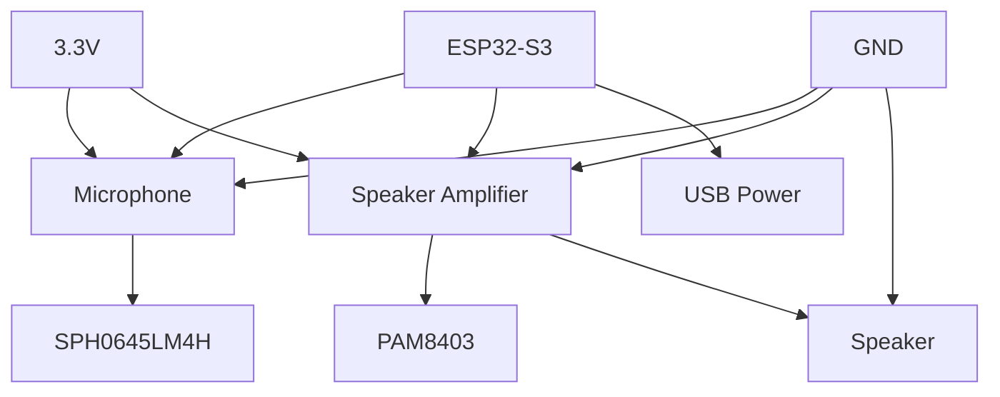

# 🔌 First Device Setup

Connect your first ESP32 device to Xiaozhi and start having conversations! This guide will walk you through the complete process from hardware setup to voice interaction.

## 🎯 What You'll Accomplish

By the end of this guide, you'll have:
- ✅ ESP32 device properly configured
- ✅ Firmware compiled and flashed
- ✅ Device connected to Xiaozhi server
- ✅ Voice interaction working
- ✅ Basic commands responding

## 🔧 Hardware Setup

### **Required Components**

#### **ESP32 Development Board**
Choose one of these recommended options:

- **ESP32-S3-DevKitC-1** - Official Espressif board
- **ESP32-S3-BOX** - With built-in microphone and speaker
- **ESP32-S3-BOX-3** - Latest version with improved audio
- **ESP32-S3-Korvo-2** - Audio-focused development board

#### **Audio Components** (if not built-in)
- **Microphone**: SPH0645LM4H or INMP441
- **Speaker**: Small speaker (8Ω, 0.5W+) with amplifier
- **Amplifier**: PAM8403 or MAX98357A

#### **Connection Components**
- **USB Cable**: Type-C or Micro-USB
- **Breadboard**: For prototyping
- **Jumper Wires**: For connections
- **Resistors**: 10kΩ, 4.7kΩ

### **Wiring Diagram**



#### **Pin Connections**

| Component | ESP32-S3 Pin | Notes |
|-----------|--------------|-------|
| Microphone VCC | 3.3V | Power supply |
| Microphone GND | GND | Ground |
| Microphone WS | GPIO 15 | Word select |
| Microphone BCK | GPIO 16 | Bit clock |
| Microphone DIN | GPIO 17 | Data input |
| Amplifier VCC | 3.3V | Power supply |
| Amplifier GND | GND | Ground |
| Amplifier DIN | GPIO 18 | Audio data |
| Amplifier BCK | GPIO 19 | Bit clock |
| Amplifier LRC | GPIO 20 | Left/right clock |

## 💾 Firmware Preparation

### **Step 1: Get Firmware Source**

```bash
# Clone the ESP32 firmware repository
git clone https://github.com/78/xiaozhi-esp32.git
cd xiaozhi-esp32
```

### **Step 2: Configure Build Environment**

#### **Install ESP-IDF**

```bash
# Download ESP-IDF
git clone --recursive https://github.com/espressif/esp-idf.git
cd esp-idf
./install.sh

# Set up environment
. ./export.sh
```

#### **Alternative: Use ESP-IDF Installer**
- **Windows**: Download from [Espressif](https://espressif.com)
- **macOS**: `brew install espressif/esp-idf/esp-idf`
- **Linux**: Follow [official guide](https://docs.espressif.com/projects/esp-idf/en/latest/esp32/get-started/)

### **Step 3: Configure Firmware**

1. **Open project** in ESP-IDF
2. **Run configuration**:
   ```bash
   idf.py menuconfig
   ```

3. **Configure settings**:
   - **WiFi**: Set your network credentials
   - **Audio**: Configure microphone and speaker pins
   - **WebSocket**: Set server URL (will be configured later)

### **Step 4: Build Firmware**

```bash
# Build the firmware
idf.py build

# This creates firmware.bin in build/ directory
```

## 🔌 Device Flashing

### **Method 1: Web-based Flashing (Easiest)**

1. **Go to**: [ESP-Launchpad](https://espressif.github.io/esp-launchpad/)
2. **Upload firmware**: Select your `firmware.bin` file
3. **Connect ESP32**: Via USB cable
4. **Select port**: Choose your ESP32's COM port
5. **Flash**: Click "Flash" and wait for completion

### **Method 2: Command Line**

```bash
# Install esptool
pip install esptool

# Flash firmware (adjust port and baud rate)
esptool.py --chip esp32s3 --port COM3 --baud 921600 write_flash 0x0 firmware.bin
```

### **Method 3: ESP-IDF**

```bash
# Flash using ESP-IDF
idf.py -p COM3 flash

# Monitor output
idf.py -p COM3 monitor
```

## 🌐 Network Configuration

### **Step 1: Configure WiFi**

1. **Power on** your ESP32 device
2. **Wait for WiFi setup** mode (LED indication)
3. **Connect to ESP32** WiFi network
4. **Open browser** to configuration page
5. **Enter WiFi credentials**:
   - Network name (SSID)
   - Password
   - Server URL: `ws://YOUR_SERVER_IP:8000/xiaozhi/v1/`

### **Step 2: Verify Connection**

1. **Check OTA interface**: http://YOUR_SERVER_IP:8003/xiaozhi/ota/
2. **Look for your device** in the connected devices list
3. **Verify WebSocket connection** is active

## 🎤 Audio Testing

### **Step 1: Test Microphone**

1. **Say "Hello"** near the microphone
2. **Check server logs** for audio input
3. **Verify audio levels** are appropriate

### **Step 2: Test Speaker**

1. **Send test command** via web interface
2. **Listen for audio output**
3. **Adjust volume** if needed

### **Step 3: Test Voice Interaction**

1. **Say**: "Hello Xiaozhi"
2. **Wait for response**
3. **Try basic commands**:
   - "What's the weather?"
   - "Tell me a joke"
   - "What time is it?"

## ⚙️ Device Configuration

### **Web Interface Configuration**

1. **Open web interface**: http://YOUR_SERVER_IP:8001
2. **Go to Devices** section
3. **Find your ESP32** device
4. **Configure settings**:
   - Device name
   - Audio settings
   - Wake word sensitivity
   - Response behavior

### **Advanced Configuration**

```yaml
# Device configuration example
device:
  name: "My ESP32 Assistant"
  wake_word: "Hello Xiaozhi"
  audio:
    microphone_gain: 1.0
    speaker_volume: 0.8
    noise_reduction: true
  behavior:
    response_delay: 0.5
    max_response_length: 100
    enable_interruptions: true
```

## 🧪 Testing and Validation

### **Basic Functionality Tests**

1. **Wake Word Detection**
   - Say "Hello Xiaozhi"
   - Verify device responds

2. **Voice Recognition**
   - Speak clearly
   - Check text accuracy

3. **Response Generation**
   - Ask questions
   - Verify appropriate responses

4. **Audio Output**
   - Listen to synthesized speech
   - Check audio quality

### **Advanced Tests**

1. **Multiple Commands**
   - Try various command types
   - Test conversation flow

2. **Error Handling**
   - Test with unclear speech
   - Verify graceful error handling

3. **Performance**
   - Measure response times
   - Check resource usage

## 🛠️ Troubleshooting

### **Device Won't Connect**

1. **Check WiFi credentials**
2. **Verify server URL** format
3. **Check firewall** settings
4. **Restart device** and server

### **No Audio Input**

1. **Check microphone** connections
2. **Verify audio** configuration
3. **Test microphone** separately
4. **Check audio levels**

### **No Audio Output**

1. **Check speaker** connections
2. **Verify amplifier** power
3. **Test speaker** separately
4. **Check volume** settings

### **Poor Voice Recognition**

1. **Improve microphone** positioning
2. **Reduce background** noise
3. **Adjust microphone** gain
4. **Check audio** quality

## 🎉 Success! What's Next?

### **🎯 Try These Features**

- **Voice Commands**: Control your device with voice
- **Conversations**: Have natural conversations
- **Custom Responses**: Create personalized responses
- **Integrations**: Connect to other services

### **🔧 Advanced Configuration**

1. **Custom Wake Words**: Set your own wake phrase
2. **Audio Optimization**: Fine-tune audio settings
3. **Response Customization**: Personalize AI responses
4. **Plugin Integration**: Add custom functionality

### **📚 Next Steps**

- **[Configuration Guide](../configuration/basic-setup.md)** - Fine-tune your setup
- **[Features Guide](../features/voice-interaction.md)** - Explore capabilities
- **[Integrations Guide](../guides/homeassistant.md)** - Connect to other systems
- **[Custom Plugins](../guides/custom-plugins.md)** - Add custom functionality

## 🆘 Need Help?

- **Hardware Issues?** Check [Hardware Troubleshooting](../hardware/troubleshooting.md)
- **Configuration Problems?** See [Configuration Guide](../configuration/basic-setup.md)
- **General Issues?** Browse [Troubleshooting Guide](../support/troubleshooting.md)

---

## 🎯 Quick Reference

### **Key Commands**
```bash
# Build firmware
idf.py build

# Flash firmware
idf.py -p COM3 flash

# Monitor output
idf.py -p COM3 monitor
```

### **Key URLs**
- **OTA Interface**: http://YOUR_SERVER_IP:8003/xiaozhi/ota/
- **Web Interface**: http://YOUR_SERVER_IP:8001
- **Device Config**: Web Interface → Devices

### **Pin Reference**
- **Microphone**: GPIO 15-17
- **Speaker**: GPIO 18-20
- **Power**: 3.3V, GND

---

**Congratulations! Your ESP32 device is now connected and ready for voice interaction! 🎉**

👉 **[Next: Configuration Guide →](../configuration/basic-setup.md)**
