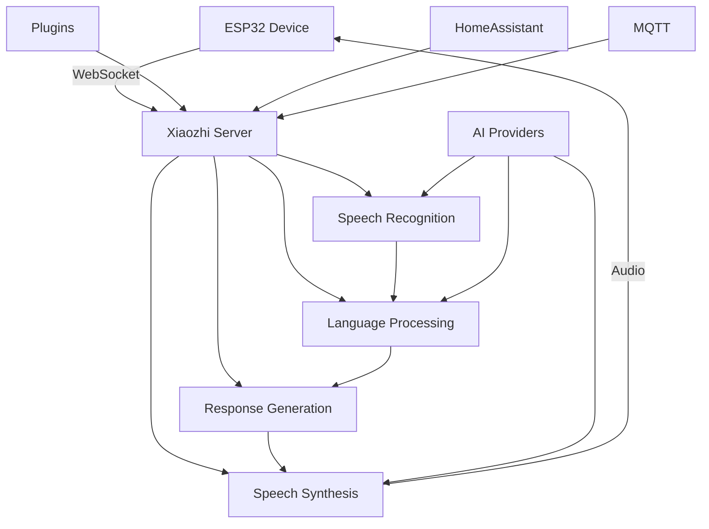

# 🎯 What is Xiaozhi ESP32 Server?

Xiaozhi ESP32 Server is a powerful backend service that transforms ESP32 microcontrollers into intelligent voice-controlled devices. Think of it as the "brain" that enables your ESP32 to understand speech, process requests, and respond with synthesized voice.

## 🌟 What Makes Xiaozhi Special?

### 🎤 **Voice-First Design**
- **Real-time speech recognition** using Whisper, OpenAI, or other ASR providers
- **Natural language processing** powered by OpenAI, LMStudio, or local LLMs
- **High-quality speech synthesis** with EdgeTTS, OpenAI TTS, or other providers
- **Low-latency communication** via WebSocket for responsive interactions

### 🔌 **ESP32 Integration**
- **Direct ESP32 support** - works with most ESP32 development boards
- **WebSocket communication** - reliable, real-time data exchange
- **OTA updates** - update firmware over-the-air
- **Hardware flexibility** - supports various ESP32 configurations

### 🤖 **AI-Powered Intelligence**
- **Multiple AI providers** - OpenAI, LMStudio, Whisper, EdgeTTS
- **Local processing** - run AI models locally for privacy
- **Cloud integration** - leverage cloud AI services when needed
- **Customizable responses** - tailor AI behavior to your needs

### 🏠 **Smart Home Ready**
- **HomeAssistant integration** - seamless smart home connectivity
- **MQTT support** - communicate with IoT devices
- **Plugin system** - extend functionality with custom plugins
- **REST API** - integrate with other systems

## 🎮 What Can You Build?

### 🏠 **Smart Home Assistant**
Transform your ESP32 into a voice-controlled smart home hub:
- Control lights, thermostats, and appliances
- Get weather updates and news
- Set reminders and timers
- Answer questions about your home

### 🤖 **Voice-Controlled Robot**
Build an intelligent robot that responds to voice commands:
- Navigate using voice instructions
- Perform tasks based on spoken requests
- Provide status updates via voice
- Learn and adapt to your preferences

### 🎯 **Interactive Projects**
Create engaging interactive experiences:
- Voice-controlled games
- Educational tools
- Accessibility devices
- Creative installations

### 🏢 **Professional Solutions**
Deploy Xiaozhi in professional environments:
- Voice-controlled automation systems
- Customer service interfaces
- Industrial monitoring devices
- Educational platforms

## 🏗️ How It Works

### 🔄 **The Voice Interaction Flow**

1. **🎤 Speech Input**: ESP32 captures audio and sends it to the server
2. **🧠 Speech Recognition**: Server converts speech to text using ASR
3. **💭 Language Processing**: LLM processes the text and generates responses
4. **🔊 Speech Synthesis**: Server converts response to audio
5. **📡 Audio Output**: ESP32 plays the synthesized speech

### 🔌 **Communication Protocol**

- **WebSocket Connection**: Real-time, bidirectional communication
- **Audio Streaming**: Efficient audio data transmission
- **Command Protocol**: Structured command and response format
- **Error Handling**: Robust error recovery and retry mechanisms

## 🎯 Key Features

### ✨ **Core Capabilities**
- **Real-time voice interaction** with sub-second response times
- **Multi-language support** for global accessibility
- **Offline operation** with local AI models
- **Cloud integration** for advanced AI capabilities
- **Extensible architecture** with plugin support

### 🛠️ **Developer Features**
- **REST API** for programmatic access
- **WebSocket API** for real-time communication
- **Plugin system** for custom functionality
- **Configuration management** via web interface
- **Comprehensive logging** for debugging

### 🔒 **Security & Privacy**
- **Local processing** options for sensitive data
- **Secure communication** with TLS support
- **Access control** and user management
- **Data privacy** with configurable retention

## 🚀 Why Choose Xiaozhi?

### 🎯 **For Beginners**
- **Easy setup** with Docker and guided configuration
- **Clear documentation** with step-by-step tutorials
- **Active community** for support and inspiration
- **Low cost** with free AI provider options

### 👨‍💻 **For Developers**
- **Open source** with full access to code
- **Extensible architecture** for custom features
- **Multiple AI providers** for flexibility
- **Professional APIs** for integration

### 🏢 **For Organizations**
- **Scalable deployment** options
- **Enterprise features** like user management
- **Integration capabilities** with existing systems
- **Professional support** and documentation

## 🎮 Getting Started

Ready to build something amazing? Here's how to get started:

1. **📋 Check Prerequisites** - [What you'll need](prerequisites.md)
2. **⚡ Quick Setup** - [Get running in 5 minutes](quick-start.md)
3. **🔌 Connect Device** - [Set up your first ESP32](first-device.md)

## 🤝 Community & Support

- **💬 GitHub Discussions** - Ask questions and share projects
- **🐛 Issue Tracker** - Report bugs and request features
- **📚 Documentation** - Comprehensive guides and references
- **🌟 Showcase** - Share your amazing projects

---

**Ready to transform your ESP32 into an intelligent voice assistant? Let's get started!** 🚀

👉 **[Next: Prerequisites →](prerequisites.md)**
