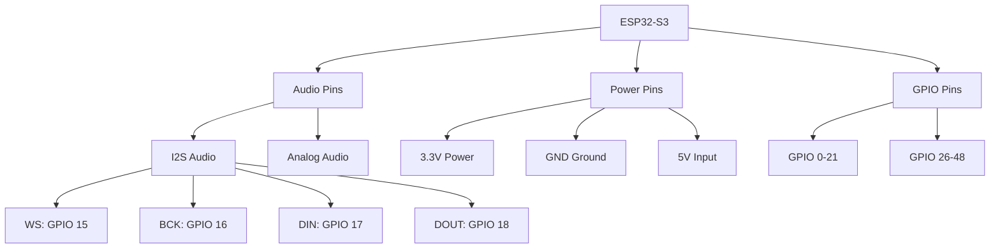

# 🔧 ESP32 Firmware Compilation

This guide covers how to compile ESP32 firmware for Xiaozhi ESP32 Server, including both custom compilation and using pre-compiled firmware.

## 🎯 Firmware Options

### **Option 1: Custom Firmware Compilation**
- **Full control** over firmware features
- **Custom OTA addresses** and configurations
- **Latest features** and bug fixes
- **Requires ESP-IDF** development environment

### **Option 2: Pre-compiled Firmware**
- **Quick setup** with minimal configuration
- **No development environment** required
- **OTA address modification** only
- **Requires firmware version 1.6.1+**

## 📋 Prerequisites

### **For Custom Compilation**
- **ESP-IDF 5.3.2+** development environment
- **Python 3.10+** with pip
- **Git** for source code management
- **USB drivers** for ESP32 board

### **For Pre-compiled Firmware**
- **ESP32 board** with firmware version 1.6.1+
- **Web browser** for OTA configuration
- **Network access** to your Xiaozhi server

## 🚀 Option 1: Custom Firmware Compilation

### **Step 1: Prepare OTA Address**

**For Simple Server Deployment:**
1. Open your OTA address: `http://YOUR_IP:8003/xiaozhi/ota/`
2. Verify it shows: "OTA interface is running normally, the websocket address sent to the device is: ws://xxx:8000/xiaozhi/v1/"
3. Test WebSocket connection using `test_page.html`

**For Full Module Deployment:**
1. Open your OTA address: `http://YOUR_IP:8003/xiaozhi/ota/`
2. Verify it shows: "OTA interface is running normally, websocket cluster count: X"
3. If not working, configure `server.websocket` in Smart Control Panel

### **Step 2: Set Up ESP-IDF Environment**

Follow the [Windows ESP-IDF 5.3.2 Development Environment Setup Guide](https://github.com/lapy/xiaozhi-esp32-server/wiki) for detailed instructions.

**Quick Setup:**
```bash
# Install ESP-IDF
git clone --recursive https://github.com/espressif/esp-idf.git
cd esp-idf
./install.sh

# Set up environment
. ./export.sh
```

### **Step 3: Download Firmware Source Code**

```bash
# Clone the ESP32 firmware repository
git clone https://github.com/78/xiaozhi-esp32.git
cd xiaozhi-esp32
```

### **Step 4: Configure OTA Address**

Edit `main/Kconfig.projbuild` and modify the OTA URL:

**Before modification:**
```
config OTA_URL
    string "Default OTA URL"
    default "https://api.tenclass.net/xiaozhi/ota/"
    help
        The application will access this URL to check for new firmwares and server address.
```

**After modification:**
```
config OTA_URL
    string "Default OTA URL"
    default "http://192.168.1.25:8003/xiaozhi/ota/"
    help
        The application will access this URL to check for new firmwares and server address.
```

### **Step 5: Set Compilation Parameters**

```bash
# Set target board (replace esp32s3 with your board)
idf.py set-target esp32s3

# Enter menu configuration
idf.py menuconfig
```

**In menuconfig:**
1. Go to `Xiaozhi Assistant`
2. Set `BOARD_TYPE` to your specific board model
3. Save and exit

### **Step 6: Compile Firmware**

```bash
# Build the firmware
idf.py build
```

### **Step 7: Package Firmware**

```bash
# Navigate to scripts directory
cd scripts

# Package the firmware
python release.py
```

This creates `merged-binary.bin` in the `build` directory.

### **Step 8: Flash Firmware**

**Method 1: Web-based Flashing (Recommended)**
1. Open: https://espressif.github.io/esp-launchpad/
2. Upload `merged-binary.bin`
3. Connect ESP32 via USB
4. Select correct COM port
5. Click "Flash"

**Method 2: Command Line**
```bash
# Flash using esptool
esptool.py --chip esp32s3 --port COM3 --baud 921600 write_flash 0x0 merged-binary.bin
```

## 🚀 Option 2: Pre-compiled Firmware Configuration

### **Step 1: Download Pre-compiled Firmware**

Download firmware version 1.6.1 or above from: https://github.com/78/xiaozhi-esp32/releases

### **Step 2: Flash Pre-compiled Firmware**

**Web-based Flashing:**
1. Open: https://espressif.github.io/esp-launchpad/
2. Upload the downloaded firmware file
3. Connect ESP32 via USB
4. Flash the firmware

### **Step 3: Configure OTA Address**

**For Full Module Deployment:**
1. Open OTA address: `http://YOUR_IP:8003/xiaozhi/ota/`
2. Verify it shows: "OTA interface is running normally, websocket cluster count: X"
3. If not working, configure `server.websocket` in Smart Control Panel

**For Simple Server Deployment:**
1. Open OTA address: `http://YOUR_IP:8003/xiaozhi/ota/`
2. Verify it shows: "OTA interface is running normally"
3. Test WebSocket connection

### **Step 4: Enter Network Configuration Mode**

1. **Wake up the device** and say "Advanced Options"
2. **Click "Advanced Options"** at the top of the page
3. **Enter your server's OTA address**
4. **Click Save** and restart the device

**Example OTA Address:**
```
http://192.168.1.25:8003/xiaozhi/ota/
```

### **Step 5: Test Connection**

1. **Wake up Xiaozhi** using the wake word
2. **Check server logs** for connection confirmation
3. **Test voice interaction** with basic commands

## 🔧 Supported ESP32 Boards

### **Recommended Boards**

| Board | Chip | Features | Price | Best For |
|-------|------|----------|-------|----------|
| **ESP32-S3-DevKitC-1** | ESP32-S3 | Official board, good I/O | $15-25 | Development |
| **ESP32-S3-BOX** | ESP32-S3 | Built-in mic/speaker, display | $35-45 | Complete solution |
| **ESP32-S3-BOX-3** | ESP32-S3 | Improved audio, display | $40-50 | Production |
| **ESP32-S3-Korvo-2** | ESP32-S3 | High-quality audio array | $30-40 | Audio-focused |

### **Budget Options**

| Board | Chip | Features | Price | Best For |
|-------|------|----------|-------|----------|
| **ESP32-DevKitC** | ESP32 | Basic development | $8-15 | Learning |
| **ESP32-WROOM-32** | ESP32 | Module + dev board | $6-12 | Cost-sensitive |
| **ESP32-S2-Saola-1** | ESP32-S2 | Single-core option | $10-18 | Simple projects |

## 🎤 Audio Components

### **Microphone Options**

**Digital MEMS Microphones:**
- **SPH0645LM4H**: I2S interface, high quality
- **INMP441**: I2S interface, budget option
- **ICS-43434**: I2S interface, professional grade

**Analog Microphones:**
- **MAX9814**: Built-in AGC, easy to use
- **MAX4466**: Budget option
- **ADMP401**: Good quality

### **Speaker Options**

**Amplifier Modules:**
- **PAM8403**: Stereo, 3W power
- **MAX98357A**: Mono, excellent quality
- **TDA2822**: Simple, budget option

**Speakers:**
- **Small Speaker**: 8Ω, 0.5W+ power
- **Piezo Buzzer**: Simple beeps only
- **Headphone Jack**: External audio output

## 🔌 Pin Configurations

### **ESP32-S3 Standard Pinout**

| Function | ESP32-S3 Pin | ESP32 Pin | Notes |
|----------|--------------|-----------|-------|
| **Microphone WS** | GPIO 15 | GPIO 25 | Word select |
| **Microphone BCK** | GPIO 16 | GPIO 26 | Bit clock |
| **Microphone DIN** | GPIO 17 | GPIO 27 | Data input |
| **Speaker DOUT** | GPIO 18 | GPIO 32 | Data output |
| **Speaker BCK** | GPIO 19 | GPIO 33 | Bit clock |
| **Speaker LRC** | GPIO 20 | GPIO 25 | Left/right clock |
| **Power 3.3V** | 3.3V | 3.3V | Power supply |
| **Ground** | GND | GND | Ground |

### **Wiring Diagram**

```
ESP32-S3          Microphone          Speaker
    |                  |                  |
    |-- 3.3V ----------|-- VCC             |
    |-- GND -----------|-- GND ------------|-- GND
    |-- GPIO 15 -------|-- WS              |
    |-- GPIO 16 -------|-- BCK             |
    |-- GPIO 17 -------|-- DIN             |
    |-- GPIO 18 ---------------------------|-- DIN
    |-- GPIO 19 ---------------------------|-- BCK
    |-- GPIO 20 ---------------------------|-- LRC
```

## 🛠️ Troubleshooting

### **Common Issues**

#### **Firmware Won't Flash**
1. **Check USB connection** and drivers
2. **Verify COM port** selection
3. **Try different baud rates** (115200, 921600)
4. **Reset ESP32** before flashing

#### **Device Won't Connect**
1. **Verify OTA address** format and accessibility
2. **Check WebSocket address** configuration
3. **Test network connectivity** from ESP32
4. **Check firewall** settings

#### **No Audio Input/Output**
1. **Check microphone connections** (GPIO 15-17)
2. **Verify speaker connections** (GPIO 18-20)
3. **Test power supply** (3.3V, GND)
4. **Check audio component** functionality

#### **Poor Voice Recognition**
1. **Improve microphone positioning**
2. **Reduce background noise**
3. **Check audio levels** and gain
4. **Verify ASR model** configuration

### **Performance Optimization**

#### **Reduce Latency**
1. **Use faster ASR models** (WhisperASR base)
2. **Enable streaming** processing
3. **Optimize network** connection
4. **Use local AI providers**

#### **Improve Accuracy**
1. **Use larger ASR models** (WhisperASR large)
2. **Specify language** in configuration
3. **Improve audio quality**
4. **Reduce noise** in environment

## 🎯 Next Steps

### **After Firmware Setup**

1. **[Configure AI Providers](../configuration/providers.md)** - Set up your AI services
2. **[Test Voice Interaction](../features/voice-interaction.md)** - Verify everything works
3. **[Connect to Server](../getting-started/first-device.md)** - Complete device setup
4. **[Advanced Configuration](../configuration/advanced.md)** - Fine-tune settings

### **Advanced Topics**

- **[Custom Hardware](../hardware/custom.md)** - Design custom hardware
- **[Performance Optimization](../hardware/optimization.md)** - Optimize for your use case
- **[Hardware Troubleshooting](../hardware/troubleshooting.md)** - Common issues and solutions

## 🆘 Need Help?

- **Firmware Issues?** Check [Troubleshooting](../support/troubleshooting.md)
- **Hardware Questions?** See [Hardware Troubleshooting](../hardware/troubleshooting.md)
- **General Questions?** Browse [FAQ](../support/faq.md)

---

## 🎯 Quick Reference

### **Firmware Compilation**
```bash
# Set target
idf.py set-target esp32s3

# Configure
idf.py menuconfig

# Build
idf.py build

# Package
cd scripts && python release.py
```

### **Pre-compiled Firmware**
1. Download from GitHub releases
2. Flash using ESP-Launchpad
3. Configure OTA address
4. Test connection

### **Key URLs**
- **OTA Interface**: http://YOUR_IP:8003/xiaozhi/ota/
- **WebSocket**: ws://YOUR_IP:8000/xiaozhi/v1/
- **ESP-Launchpad**: https://espressif.github.io/esp-launchpad/

---

**Your ESP32 firmware is ready! 🎉**

👉 **[Next: Configure AI Providers →](../configuration/providers.md)**

### **💡 Budget Options**

These boards offer good value for money:

#### **ESP32-DevKitC**
- **Chip**: ESP32 (Dual-core, 240MHz)
- **Memory**: 520KB SRAM
- **Audio**: External microphone/speaker required
- **Price**: $8-15
- **Best for**: Learning, basic projects

#### **ESP32-WROOM-32**
- **Chip**: ESP32 (Dual-core, 240MHz)
- **Memory**: 520KB SRAM
- **Audio**: External microphone/speaker required
- **Price**: $6-12
- **Best for**: Cost-sensitive projects

#### **ESP32-S2-Saola-1**
- **Chip**: ESP32-S2 (Single-core, 240MHz)
- **Memory**: 320KB SRAM
- **Audio**: External microphone/speaker required
- **Price**: $10-18
- **Best for**: Simple applications

### **🎯 Specialized Boards**

These boards offer specific features for particular use cases:

#### **ESP32-S3-BOX-Lite**
- **Chip**: ESP32-S3 (Dual-core, 240MHz)
- **Memory**: 512KB SRAM, 8MB PSRAM
- **Audio**: Built-in microphone and speaker
- **Price**: $25-35
- **Best for**: Compact voice assistant

#### **ESP32-S3-EYE**
- **Chip**: ESP32-S3 (Dual-core, 240MHz)
- **Memory**: 512KB SRAM, 8MB PSRAM
- **Audio**: Built-in microphone
- **Camera**: 2MP camera module
- **Price**: $30-40
- **Best for**: Vision + voice applications

#### **ESP32-S3-USB-OTG**
- **Chip**: ESP32-S3 (Dual-core, 240MHz)
- **Memory**: 512KB SRAM, 8MB PSRAM
- **USB**: USB OTG support
- **Price**: $20-30
- **Best for**: USB device applications

## 🔌 Hardware Requirements

### **Minimum Requirements**

| Component | Requirement | Notes |
|-----------|-------------|-------|
| **Chip** | ESP32 or ESP32-S3 | Dual-core recommended |
| **Memory** | 320KB+ SRAM | More memory = better performance |
| **Storage** | 4MB+ Flash | For firmware and audio buffers |
| **WiFi** | 802.11 b/g/n | Required for server communication |
| **Audio** | I2S interface | For microphone and speaker |

### **Recommended Specifications**

| Component | Specification | Benefits |
|-----------|---------------|----------|
| **Chip** | ESP32-S3 | Better performance, more features |
| **Memory** | 512KB+ SRAM, 8MB+ PSRAM | Smooth audio processing |
| **Storage** | 8MB+ Flash | Room for updates and features |
| **Audio** | Built-in microphone/speaker | Easier setup, better integration |
| **Display** | Optional LCD | Visual feedback and control |

## 🎤 Audio Components

### **Microphone Options**

#### **Digital MEMS Microphones**

| Model | Interface | Sensitivity | Price | Notes |
|-------|-----------|-------------|-------|-------|
| **SPH0645LM4H** | I2S | -26dBFS | $2-4 | High quality, recommended |
| **INMP441** | I2S | -26dBFS | $1-3 | Good quality, budget option |
| **ICS-43434** | I2S | -26dBFS | $3-5 | Professional grade |

#### **Analog Microphones**

| Model | Interface | Sensitivity | Price | Notes |
|-------|-----------|-------------|-------|-------|
| **MAX9814** | Analog | 60dB | $2-4 | Built-in AGC, easy to use |
| **MAX4466** | Analog | 60dB | $1-3 | Budget option |
| **ADMP401** | Analog | 60dB | $2-4 | Good quality |

### **Speaker Options**

#### **Amplifier Modules**

| Model | Power | Interface | Price | Notes |
|-------|-------|-----------|-------|-------|
| **PAM8403** | 3W | I2S | $1-2 | Stereo, good quality |
| **MAX98357A** | 3.2W | I2S | $2-4 | Mono, excellent quality |
| **TDA2822** | 1W | Analog | $1-2 | Simple, budget option |

#### **Speakers**

| Type | Power | Impedance | Price | Notes |
|------|-------|-----------|-------|-------|
| **Small Speaker** | 0.5W | 8Ω | $1-3 | Basic audio output |
| **Piezo Buzzer** | 0.1W | N/A | $0.5-1 | Simple beeps only |
| **Headphone Jack** | N/A | 32Ω | $1-2 | External audio output |

## 🔌 Pin Configurations

### **ESP32-S3 Pin Mapping**



### **Standard Audio Pinout**

| Function | ESP32-S3 Pin | ESP32 Pin | Notes |
|----------|--------------|-----------|-------|
| **Microphone WS** | GPIO 15 | GPIO 25 | Word select |
| **Microphone BCK** | GPIO 16 | GPIO 26 | Bit clock |
| **Microphone DIN** | GPIO 17 | GPIO 27 | Data input |
| **Speaker DOUT** | GPIO 18 | GPIO 32 | Data output |
| **Speaker BCK** | GPIO 19 | GPIO 33 | Bit clock |
| **Speaker LRC** | GPIO 20 | GPIO 25 | Left/right clock |
| **Power 3.3V** | 3.3V | 3.3V | Power supply |
| **Ground** | GND | GND | Ground |

### **Alternative Pin Configurations**

#### **Custom Pin Mapping**
```yaml
# Custom pin configuration
audio:
  microphone:
    ws_pin: 15
    bck_pin: 16
    din_pin: 17
  speaker:
    dout_pin: 18
    bck_pin: 19
    lrc_pin: 20
```

## 🔧 Hardware Setup

### **Basic Audio Setup**

#### **Wiring Diagram**

```
ESP32-S3          Microphone          Speaker
    |                  |                  |
    |-- 3.3V ----------|-- VCC             |
    |-- GND -----------|-- GND ------------|-- GND
    |-- GPIO 15 -------|-- WS              |
    |-- GPIO 16 -------|-- BCK             |
    |-- GPIO 17 -------|-- DIN             |
    |-- GPIO 18 ---------------------------|-- DIN
    |-- GPIO 19 ---------------------------|-- BCK
    |-- GPIO 20 ---------------------------|-- LRC
```

#### **Step-by-Step Wiring**

1. **Connect Power**
   - Connect 3.3V to microphone VCC
   - Connect GND to microphone GND and speaker GND

2. **Connect Microphone**
   - Connect GPIO 15 to microphone WS
   - Connect GPIO 16 to microphone BCK
   - Connect GPIO 17 to microphone DIN

3. **Connect Speaker**
   - Connect GPIO 18 to speaker DIN
   - Connect GPIO 19 to speaker BCK
   - Connect GPIO 20 to speaker LRC

### **Advanced Audio Setup**

#### **Microphone Array**
```yaml
# Multiple microphones for better audio
microphones:
  - pin: 15
    gain: 1.0
  - pin: 21
    gain: 1.0
  - pin: 22
    gain: 1.0
```

#### **Stereo Audio**
```yaml
# Stereo speaker configuration
speakers:
  left:
    pin: 18
    channel: 0
  right:
    pin: 19
    channel: 1
```

## 🧪 Hardware Testing

### **Audio Component Testing**

#### **Microphone Test**
```python
# Test microphone functionality
import machine
import time

# Configure I2S for microphone
i2s = machine.I2S(
    machine.I2S.MASTER,
    sck=machine.Pin(16),
    ws=machine.Pin(15),
    sd=machine.Pin(17),
    mode=machine.I2S.RX,
    bits=16,
    format=machine.I2S.MONO,
    rate=16000,
    ibuf=40000
)

# Read audio data
audio_data = i2s.read(1000)
print(f"Audio data length: {len(audio_data)}")
```

#### **Speaker Test**
```python
# Test speaker functionality
import machine
import time

# Configure I2S for speaker
i2s = machine.I2S(
    machine.I2S.MASTER,
    sck=machine.Pin(19),
    ws=machine.Pin(20),
    sd=machine.Pin(18),
    mode=machine.I2S.TX,
    bits=16,
    format=machine.I2S.MONO,
    rate=16000,
    ibuf=40000
)

# Generate test tone
import math
samples = []
for i in range(16000):
    samples.append(int(32767 * math.sin(2 * math.pi * 440 * i / 16000)))

# Play test tone
i2s.write(bytes(samples))
```

### **Power Consumption Testing**

#### **Current Measurement**
```python
# Measure power consumption
import machine
import time

# Enable power monitoring
machine.freq(240000000)  # Set CPU frequency

# Measure current during different operations
# Idle: ~50mA
# WiFi active: ~80mA
# Audio processing: ~120mA
# Peak usage: ~200mA
```

## 🔧 Troubleshooting

### **Common Hardware Issues**

#### **No Audio Input**
1. **Check microphone connections**
2. **Verify power supply** (3.3V)
3. **Test microphone** with multimeter
4. **Check I2S configuration**

#### **No Audio Output**
1. **Check speaker connections**
2. **Verify amplifier power**
3. **Test speaker** with multimeter
4. **Check I2S configuration**

#### **Poor Audio Quality**
1. **Check power supply** stability
2. **Verify ground connections**
3. **Test with different components**
4. **Adjust gain settings**

#### **Device Won't Boot**
1. **Check power supply** (5V input)
2. **Verify USB connection**
3. **Check for short circuits**
4. **Test with minimal configuration**

### **Performance Issues**

#### **Audio Dropouts**
1. **Increase buffer sizes**
2. **Optimize WiFi settings**
3. **Check power supply**
4. **Reduce CPU load**

#### **High Latency**
1. **Optimize audio buffers**
2. **Check network latency**
3. **Reduce processing overhead**
4. **Use faster components**

## 🎯 Device Selection Guide

### **For Beginners**
- **ESP32-S3-BOX** - Complete solution with built-in audio
- **ESP32-S3-DevKitC-1** - Good for learning with external components

### **For Developers**
- **ESP32-S3-DevKitC-1** - Maximum flexibility
- **ESP32-S3-Korvo-2** - Audio-focused development

### **For Production**
- **ESP32-S3-BOX-3** - Production-ready with all features
- **ESP32-S3-BOX-Lite** - Cost-effective production option

### **For Specialized Applications**
- **ESP32-S3-EYE** - Vision + voice applications
- **ESP32-S3-USB-OTG** - USB device applications

## 🎯 Next Steps

### **After Hardware Selection**

1. **[Firmware Compilation](../hardware/firmware.md)** - Build firmware for your device
2. **[Device Flashing](../hardware/flashing.md)** - Flash firmware to your device
3. **[Hardware Testing](../hardware/troubleshooting.md)** - Test your hardware setup
4. **[Connect to Server](../getting-started/first-device.md)** - Connect to Xiaozhi server

### **Advanced Topics**

- **[Custom Hardware](../hardware/custom.md)** - Design custom hardware
- **[Performance Optimization](../hardware/optimization.md)** - Optimize for your use case
- **[Hardware Troubleshooting](../hardware/troubleshooting.md)** - Common issues and solutions

## 🆘 Need Help?

- **Hardware Questions?** Check [Hardware Troubleshooting](../hardware/troubleshooting.md)
- **Firmware Issues?** See [Firmware Guide](../hardware/firmware.md)
- **General Questions?** Browse [FAQ](../support/faq.md)

---

## 🎯 Quick Reference

### **Recommended Boards**
- **Complete Solution**: ESP32-S3-BOX-3
- **Development**: ESP32-S3-DevKitC-1
- **Budget**: ESP32-S3-BOX-Lite

### **Audio Components**
- **Microphone**: SPH0645LM4H (I2S)
- **Amplifier**: MAX98357A (I2S)
- **Speaker**: Small 8Ω speaker

### **Pin Connections**
- **Microphone**: GPIO 15-17
- **Speaker**: GPIO 18-20
- **Power**: 3.3V, GND

---

**Choose the right ESP32 device for your project! 🎉**

👉 **[Next: Firmware Compilation →](../hardware/firmware.md)**
