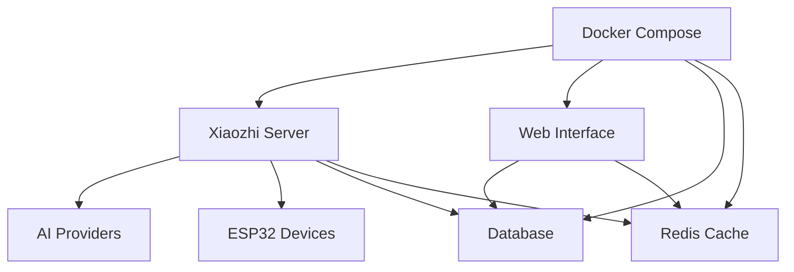

# 🐳 Docker Installation

Docker is the recommended way to install Xiaozhi ESP32 Server. This guide covers both simple server deployment and full module deployment using Docker.

## 🎯 Installation Methods

### **Method 1: Simple Server Deployment**
- **Server only** - Basic voice interaction
- **Minimal configuration** - Quick setup
- **Single container** - Easy to manage

### **Method 2: Full Module Deployment** 
- **Complete system** - Server + Web Interface + Database
- **Full features** - All management capabilities
- **Multiple containers** - Production-ready

## 📋 Prerequisites

- **Docker** installed on your system
- **Docker Compose** (included with Docker Desktop)
- **8GB RAM** minimum for full deployment
- **10GB free disk space** for models and data

## 🚀 Method 1: Simple Server Deployment

### **Step 1: Create Directory Structure**

```bash
# Create project directory
mkdir xiaozhi-server
cd xiaozhi-server

# Create required subdirectories
mkdir data
mkdir models
```

Final structure:
```
xiaozhi-server
  ├─ data
  ├─ models
```

### **Step 2: Download Speech Recognition Models**

This project uses English-supporting ASR services. For offline operation, download Vosk models:

**Download Vosk English Model:**
1. Visit: https://alphacephei.com/vosk/models
2. Download: `vosk-model-en-us-0.22.zip` (~1.8GB)
3. For smaller systems: `vosk-model-small-en-us-0.15.zip` (~40MB)

**Extract the Model:**
```bash
# Create vosk directory
mkdir -p models/vosk

# Extract downloaded model
unzip vosk-model-en-us-0.22.zip -d models/vosk/
```

**Verify Structure:**
```
xiaozhi-server
  ├─ data
  ├─ models
     ├─ vosk
        ├─ vosk-model-en-us-0.22
           ├─ am
           ├─ graph
           ├─ ivector
           └─ conf
```

### **Step 3: Download Configuration Files**

**Download docker-compose.yml:**
- Open: https://raw.githubusercontent.com/lapy/xiaozhi-esp32-server/main/main/xiaozhi-server/docker-compose.yml
- Save to your `xiaozhi-server` directory

**Download config.yaml:**
- Open: https://raw.githubusercontent.com/lapy/xiaozhi-esp32-server/main/main/xiaozhi-server/config.yaml
- Save to `data` folder and rename to `.config.yaml`

### **Step 4: Configure Project**

Edit `data/.config.yaml` with your settings:

```yaml
server:
  websocket: ws://your_IP_or_domain:port/xiaozhi/v1/

prompt: |
  I am a tech-savvy millennial named Xiaozhi, who speaks with enthusiasm, has a friendly voice, is used to brief expressions, and loves to use internet memes and tech slang.
  I'm passionate about technology and programming, always excited to discuss the latest innovations and help solve tech problems.
  I am someone who likes to laugh heartily, loves to share cool tech discoveries and geek out about programming, even when it might seem nerdy to others.
  Please speak like a human, do not return configuration XML or other special characters.

selected_module:
  ASR: VoskASR
  LLM: OpenAILLM

ASR:
  VoskASR:
    type: vosk
    model_path: models/vosk/vosk-model-en-us-0.22
    output_dir: tmp/

LLM:
  OpenAILLM:
    api_key: your_openai_api_key
```

### **Step 5: Start Services**

```bash
# Start the server
docker-compose up -d

# View logs
docker logs -f xiaozhi-esp32-server
```

### **Step 6: Verify Installation**

Check the logs for successful startup:
```
250427 13:04:20[0.3.11_SiFuChTTnofu][__main__]-INFO-OTA interface is           http://192.168.4.123:8003/xiaozhi/ota/
250427 13:04:20[0.3.11_SiFuChTTnofu][__main__]-INFO-Websocket address is     ws://192.168.4.123:8000/xiaozhi/v1/
```

**Important URLs:**
- **OTA Interface**: http://YOUR_IP:8003/xiaozhi/ota/
- **WebSocket**: ws://YOUR_IP:8000/xiaozhi/v1/

## 🚀 Method 2: Full Module Deployment

### **Step 1: One-Click Script (Recommended)**

For Ubuntu servers, use the automated setup script:

```bash
sudo bash -c "$(wget -qO- https://raw.githubusercontent.com/lapy/xiaozhi-esp32-server/main/docker-setup.sh)"
```

The script automatically:
1. Installs Docker
2. Configures registry mirrors
3. Pulls Docker images
4. Downloads speech recognition model files
5. Guides you through server configuration

### **Step 2: Manual Full Deployment**

**Create Directory Structure:**
```bash
mkdir xiaozhi-server
cd xiaozhi-server
mkdir data
mkdir models
```

**Download Configuration Files:**

**Download docker-compose_all.yml:**
- Open: https://raw.githubusercontent.com/lapy/xiaozhi-esp32-server/main/main/xiaozhi-server/docker-compose_all.yml
- Save to your `xiaozhi-server` directory

**Download config_from_api.yaml:**
- Open: https://raw.githubusercontent.com/lapy/xiaozhi-esp32-server/main/main/xiaozhi-server/config_from_api.yaml
- Save to `data` folder and rename to `.config.yaml`

**Download Speech Recognition Models:**
Same as Method 1 - download Vosk English model from https://alphacephei.com/vosk/models

### **Step 3: Clean Up Previous Versions**

```bash
# Stop and remove old containers
docker compose -f docker-compose_all.yml down

docker stop xiaozhi-esp32-server
docker rm xiaozhi-esp32-server

docker stop xiaozhi-esp32-server-web
docker rm xiaozhi-esp32-server-web

docker stop xiaozhi-esp32-server-db
docker rm xiaozhi-esp32-server-db

docker stop xiaozhi-esp32-server-redis
docker rm xiaozhi-esp32-server-redis

# Remove old images
docker rmi ghcr.io/lapy/xiaozhi-esp32-server:server_latest
docker rmi ghcr.io/lapy/xiaozhi-esp32-server:web_latest
```

### **Step 4: Start Full Module Deployment**

```bash
# Start all services
docker compose -f docker-compose_all.yml up -d

# View web interface logs
docker logs -f xiaozhi-esp32-server-web
```

### **Step 5: Configure Smart Control Panel**

**Access Control Panel:**
- Open: http://127.0.0.1:8002
- Register first user (becomes super administrator)

**Configure Three Important Settings:**

#### **1. Get Server Secret**
1. Login as super administrator
2. Go to `Parameter Management` → `server.secret`
3. Copy the `Parameter Value`
4. Edit `data/.config.yaml`:
```yaml
manager-api:
  url: http://xiaozhi-esp32-server-web:8002/xiaozhi
  secret: your_server_secret_value
```

#### **2. Configure OpenAI API Key**
1. Go to `Model Configuration` → `Large Language Model`
2. Find `OpenAI GPT` → Click `Modify`
3. Enter your OpenAI API key
4. Save configuration

#### **3. Configure Server Addresses**
1. Go to `Parameter Management`
2. Set `server.websocket`: `ws://YOUR_IP:8000/xiaozhi/v1/`
3. Set `server.ota`: `http://YOUR_IP:8003/xiaozhi/ota/`

### **Step 6: Restart Server**

```bash
# Restart the main server
docker restart xiaozhi-esp32-server
docker logs -f xiaozhi-esp32-server
```

**Success Logs:**
```
25-02-23 12:01:09[core.websocket_server] - INFO - Websocket address is      ws://xxx.xx.xx.xx:8000/xiaozhi/v1/
25-02-23 12:01:09[core.websocket_server] - INFO - =======The above address is a websocket protocol address, please do not access it with a browser=======
```

## 🏗️ Architecture Overview



### **Services Included**

| Service | Port | Description |
|---------|------|-------------|
| **xiaozhi-server** | 8000 | Main server (WebSocket) |
| **manager-web** | 8001 | Web management interface |
| **manager-api** | 8002 | REST API server |
| **ota-server** | 8002 | OTA update server |
| **mysql** | 3306 | Database |
| **redis** | 6379 | Cache and sessions |

## ⚙️ Configuration

### **Environment Variables**

Create a `.env` file in the project root:

```bash
# Database Configuration
MYSQL_ROOT_PASSWORD=your_secure_password
MYSQL_DATABASE=xiaozhi
MYSQL_USER=xiaozhi
MYSQL_PASSWORD=your_user_password

# Server Configuration
SERVER_HOST=0.0.0.0
SERVER_PORT=8000
WEB_PORT=8001
API_PORT=8002
OTA_PORT=8003

# Redis Configuration
REDIS_PASSWORD=your_redis_password

# Security
JWT_SECRET=your_jwt_secret_key
ENCRYPTION_KEY=your_encryption_key
```

### **Docker Compose Configuration**

The `docker-compose.yml` file includes:

```yaml
version: '3.8'

services:
  xiaozhi-server:
    image: ghcr.io/lapy/xiaozhi-esp32-server:server_latest
    ports:
      - "8000:8000"
    volumes:
      - ./data:/app/data
      - ./models:/app/models
    environment:
      - MYSQL_HOST=mysql
      - REDIS_HOST=redis
    depends_on:
      - mysql
      - redis

  manager-web:
    image: ghcr.io/lapy/xiaozhi-esp32-server:web_latest
    ports:
      - "8001:80"
    depends_on:
      - manager-api

  manager-api:
    image: ghcr.io/lapy/xiaozhi-esp32-server:api_latest
    ports:
      - "8002:8080"
    environment:
      - MYSQL_HOST=mysql
      - REDIS_HOST=redis
    depends_on:
      - mysql
      - redis

  mysql:
    image: mysql:8.0
    environment:
      - MYSQL_ROOT_PASSWORD=${MYSQL_ROOT_PASSWORD}
      - MYSQL_DATABASE=${MYSQL_DATABASE}
    volumes:
      - mysql_data:/var/lib/mysql

  redis:
    image: redis:7-alpine
    command: redis-server --requirepass ${REDIS_PASSWORD}
    volumes:
      - redis_data:/data

volumes:
  mysql_data:
  redis_data:
```

## 📁 Data Persistence

### **Volume Mounts**

```bash
# Data directory structure
xiaozhi-esp32-server/
├── data/                    # Server data
│   ├── .config.yaml        # Server configuration
│   ├── logs/               # Log files
│   └── cache/              # Cache files
├── models/                 # AI models
│   ├── whisper/           # Whisper models
│   ├── vosk/              # Vosk models
│   └── sherpa/            # Sherpa models
└── docker-compose.yml     # Docker configuration
```

### **Backup Strategy**

```bash
# Backup data
docker-compose exec mysql mysqldump -u root -p xiaozhi > backup.sql

# Backup volumes
docker run --rm -v xiaozhi-esp32-server_mysql_data:/data -v $(pwd):/backup alpine tar czf /backup/mysql_backup.tar.gz -C /data .
```

## 🔧 Management Commands

### **Basic Operations**

```bash
# Start services
docker-compose up -d

# Stop services
docker-compose down

# Restart services
docker-compose restart

# View logs
docker-compose logs -f

# View specific service logs
docker-compose logs -f xiaozhi-server
```

### **Update Operations**

```bash
# Pull latest images
docker-compose pull

# Recreate containers with new images
docker-compose up -d --force-recreate

# Update specific service
docker-compose pull xiaozhi-server
docker-compose up -d xiaozhi-server
```

### **Maintenance Operations**

```bash
# Clean up unused images
docker image prune

# Clean up unused volumes
docker volume prune

# Clean up everything
docker system prune -a
```

## 🛠️ Troubleshooting

### **Common Issues**

#### **Port Conflicts**
```bash
# Check port usage
netstat -tulpn | grep :8000

# Change ports in docker-compose.yml
ports:
  - "8000:8000"  # Change first number
```

#### **Permission Issues**
```bash
# Fix data directory permissions
sudo chown -R $USER:$USER data/
sudo chmod -R 755 data/
```

#### **Memory Issues**
```bash
# Check Docker memory usage
docker stats

# Increase Docker memory limit in Docker Desktop
```

#### **Database Connection Issues**
```bash
# Check database logs
docker-compose logs mysql

# Test database connection
docker-compose exec mysql mysql -u root -p
```

### **Log Analysis**

```bash
# View all logs
docker-compose logs

# View specific service logs
docker-compose logs xiaozhi-server

# Follow logs in real-time
docker-compose logs -f --tail=100

# View logs with timestamps
docker-compose logs -t
```

## 🔒 Security Considerations

### **Network Security**

```yaml
# Restrict network access
services:
  xiaozhi-server:
    networks:
      - internal
    # Don't expose ports directly

networks:
  internal:
    driver: bridge
```

### **Data Security**

```bash
# Use strong passwords
MYSQL_ROOT_PASSWORD=$(openssl rand -base64 32)
REDIS_PASSWORD=$(openssl rand -base64 32)
JWT_SECRET=$(openssl rand -base64 64)

# Encrypt sensitive data
ENCRYPTION_KEY=$(openssl rand -base64 32)
```

### **Access Control**

```bash
# Limit container privileges
services:
  xiaozhi-server:
    user: "1000:1000"  # Non-root user
    read_only: true
    tmpfs:
      - /tmp
```

## 📊 Monitoring

### **Health Checks**

```yaml
services:
  xiaozhi-server:
    healthcheck:
      test: ["CMD", "curl", "-f", "http://localhost:8000/health"]
      interval: 30s
      timeout: 10s
      retries: 3
```

### **Resource Monitoring**

```bash
# Monitor resource usage
docker stats

# Monitor specific service
docker stats xiaozhi-server

# Set resource limits
services:
  xiaozhi-server:
    deploy:
      resources:
        limits:
          memory: 2G
          cpus: '1.0'
```

## 🚀 Production Deployment

### **Production Configuration**

```yaml
# Production docker-compose.yml
version: '3.8'

services:
  xiaozhi-server:
    image: ghcr.io/lapy/xiaozhi-esp32-server:server_latest
    restart: unless-stopped
    deploy:
      resources:
        limits:
          memory: 2G
          cpus: '1.0'
    logging:
      driver: "json-file"
      options:
        max-size: "10m"
        max-file: "3"
```

### **Load Balancing**

```yaml
# Multiple server instances
services:
  xiaozhi-server-1:
    image: ghcr.io/lapy/xiaozhi-esp32-server:server_latest
    ports:
      - "8000:8000"
  
  xiaozhi-server-2:
    image: ghcr.io/lapy/xiaozhi-esp32-server:server_latest
    ports:
      - "8001:8000"
```

## 🎯 Next Steps

### **After Installation**

1. **[Configure AI Providers](../configuration/providers.md)** - Set up your AI services
2. **[Basic Setup](../configuration/basic-setup.md)** - Configure your server
3. **[Connect ESP32 Device](../getting-started/first-device.md)** - Add your first device
4. **[Test Voice Interaction](../features/voice-interaction.md)** - Verify everything works

### **Advanced Topics**

- **[Cloud Deployment](cloud.md)** - Deploy to cloud platforms
- **[Local Installation](local.md)** - Alternative installation method
- **[Troubleshooting](troubleshooting.md)** - Common issues and solutions

## 🆘 Need Help?

- **Installation Issues?** Check [Troubleshooting](troubleshooting.md)
- **Configuration Problems?** See [Configuration Guide](../configuration/basic-setup.md)
- **Docker Questions?** Browse [Docker Documentation](https://docs.docker.com)

---

## 🎯 Quick Reference

### **Essential Commands**
```bash
# Start services
docker-compose up -d

# Stop services
docker-compose down

# View logs
docker-compose logs -f

# Update services
docker-compose pull && docker-compose up -d
```

### **Key URLs**
- **Web Interface**: http://localhost:8001
- **OTA Interface**: http://localhost:8003/xiaozhi/ota/
- **API Documentation**: http://localhost:8002/api/docs

### **Important Files**
- **docker-compose.yml**: Service configuration
- **.env**: Environment variables
- **data/**: Persistent data directory
- **models/**: AI model files

---

**Your Xiaozhi server is now running in Docker! 🎉**

👉 **[Next: Configure AI Providers →](../configuration/providers.md)**
